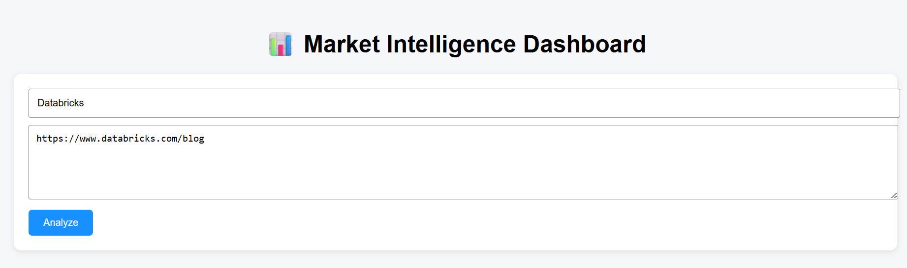
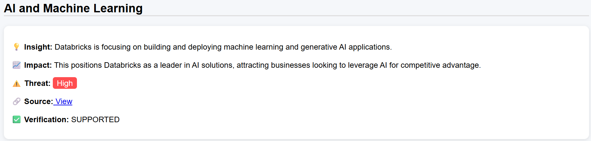
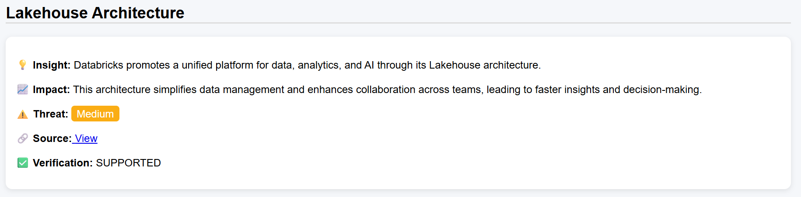
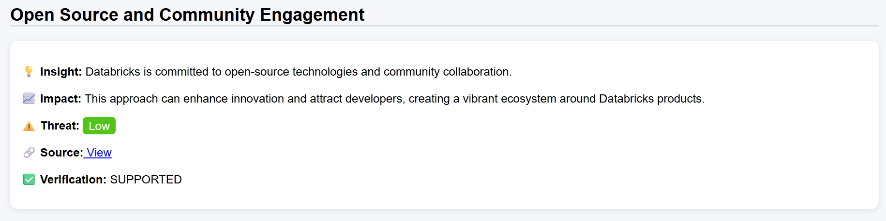

# 📊 GenAI Market Intelligence Platform

A full-stack GenAI application that helps Product and GTM teams track competitor activity and market trends by analyzing publicly available content from blogs, news, and announcements.







---

## 🚀 Live Demo

- 🌐 Frontend: https://progress-software.vercel.app/
- ⚙️ Backend API: https://progress-software.onrender.com/analyze  

---

## 🧠 Problem Statement

Product and GTM teams struggle to stay updated on competitor activity because relevant information is scattered across multiple sources.

This platform aggregates, analyzes, and summarizes market intelligence into structured, actionable insights.

---

## ✨ Features

- 🔍 Multi-source data ingestion (blogs, articles, announcements)
- 🧠 AI-powered insight generation using OpenAI
- 📊 Thematic grouping of market trends
- 🏢 Competitor activity tracking
- 📈 Business impact analysis
- ⚠️ Threat level classification (Low / Medium / High)
- ✅ Hallucination detection using LLM-as-a-judge
- 🌐 Interactive dashboard UI

---

## 🏗️ Architecture

1. **Data Ingestion**
   - Fetch content from multiple URLs

2. **Processing**
   - Clean and prepare text data

3. **LLM Analysis**
   - Generate structured insights (themes, activities, impacts)

4. **Validation Layer**
   - LLM verifies insights against source content

5. **Frontend Dashboard**
   - Displays insights in structured format

---

## 🛠️ Tech Stack

- **Backend:** FastAPI (Python)
- **Frontend:** React (JavaScript)
- **AI Models:** OpenAI GPT
- **Web Scraping:** BeautifulSoup, Requests
- **Deployment:**
  - Backend → Render
  - Frontend → Vercel

---

## 📂 Project Structure
project-root/
│
├── backend/
│ ├── app.py
│ ├── requirements.txt
│
├── frontend/
│ ├── src/
│ ├── public/
│
└── README.md


---

## ⚙️ Setup Instructions

```bash
cd backend
pip install -r requirements.txt
uvicorn app:app --reload

cd frontend
npm install
npm start

#Create your own .env file for OPEN API KEY
OPENAI_API_KEY=your_api_key_here

#Example Input
{
  "competitors": ["Databricks", "ServiceNow"],
  "urls": [
    "https://venturebeat.com/category/ai/",
    "https://www.databricks.com/blog"
  ]
}


## 🧠 Design Decisions

### 🔹 1. Choice of FastAPI for Backend
FastAPI was chosen due to its:
- High performance (async support)
- Easy integration with AI pipelines
- Built-in API documentation (/docs)

---

### 🔹 2. Use of GPT-4o-mini
Instead of larger models, GPT-4o-mini was selected because:
- Lower latency and cost
- Sufficient capability for structured summarization
- Better suited for multi-call pipelines (generation + validation)

---

### 🔹 3. Structured Output over Free Text
The system generates:
- Themes
- Insights
- Impact analysis
- Threat levels

This was done to:
- Improve readability for business users
- Enable downstream processing
- Mimic real-world market intelligence reports

---

### 🔹 4. LLM-as-a-Judge for Validation
A second LLM call validates each insight against source data.

Why:
- Reduces hallucinations
- Increases trustworthiness of outputs
- Aligns with modern GenAI evaluation practices

---

### 🔹 5. Source Traceability
Each insight includes a source URL.

Why:
- Ensures transparency
- Allows users to verify claims
- Critical for enterprise use cases

---

### 🔹 6. Scrape-Friendly Source Strategy
Instead of relying on dynamic websites (e.g., Microsoft blogs), the system uses:
- Tech news sites
- SaaS blogs
- Press release platforms

Why:
- Improves reliability of scraping
- Reduces failures due to JavaScript-heavy pages

---

### 🔹 7. Separation of Concerns (Frontend vs Backend)
- Backend handles scraping + AI processing
- Frontend handles visualization

Why:
- Better scalability
- Cleaner architecture
- Easier deployment

---

### 🔹 8. Lightweight Architecture
The system avoids heavy pipelines and uses:
- Simple scraping
- Direct LLM calls

Why:
- Faster development
- Easier debugging
- Suitable for prototype/demo use case

---

### 🔹 9. Deployment Choices
- Render (backend): simple Python hosting
- Vercel (frontend): optimized for React apps

Why:
- Free tier availability
- Quick deployment
- Industry-standard tools

---

### 🔹 10. User-Centric UI Design
Dashboard-style UI with:
- Cards
- Color-coded threat levels
- Structured sections

Why:
- Improves usability for GTM teams
- Makes insights actionable